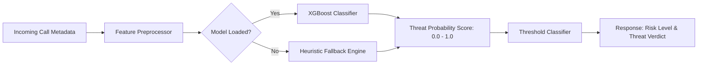

# 🛡️ SpamScanner — Real-Time Call Threat & Fraud Scoring API

[](https://github.com/rinwasourav/Spamscaner/actions/workflows/ci.yml)
[](https://www.python.org/)
[](https://fastapi.tiangolo.com/)
[](https://xgboost.readthedocs.io/)
[](LICENSE)
[](https://github.com/psf/black)

**SpamScanner** (SignalTrust) is a high-throughput machine learning inference engine and REST API designed to identify spam, robocalls, and fraudulent telephone activity in real time. Powered by an **XGBoost** classification pipeline with stratified cross-validation and a **FastAPI** backend, SpamScanner delivers sub-millisecond risk probability scores with heuristic resilience fallbacks.

---

## 📌 Architecture & System Flow



---

## ✨ Features

- 📊 **Probabilistic Threat Scoring**: Returns continuous risk scores `[0.0, 1.0]` alongside discrete classifications (`LOW`, `MEDIUM`, `HIGH`).
- 🤖 **Gradient Boosted Inference**: Supervised XGBoost classifier trained on multi-dimensional calling patterns (frequency, call duration, social network proximity, and crowd-sourced flags).
- 🔁 **Resilient Fallback Engine**: Built-in heuristic rule engine guarantees zero API downtime if the ML artifact is unavailable during cold starts or deployment syncs.
- ⚡ **Asynchronous FastAPI Microservice**: High concurrency with non-blocking I/O, lifespan lifecycle management, and OpenAPI/Swagger documentation.
- 🧪 **5-Fold Stratified Cross-Validation**: Zero test-leakage training pipeline ensuring generalizability across class imbalances.
- 📈 **Synthetic Telemetry Generator**: Configurable synthetic data generator modeling real-world call distributions using Gamma, Poisson, and Exponential processes.

---

## 📁 Repository Structure

```text
Spamscanner/
├── .github/
│   └── workflows/
│       └── ci.yml               # GitHub Actions CI automated testing pipeline
├── data/
│   └── synthetic_calls.csv     # Synthetic call training dataset
├── models/
│   └── signaltrust_xgboost.pkl # Serialized XGBoost classification artifact
├── src/
│   ├── __init__.py
│   ├── data_generator.py       # Telemetry simulation and data generator
│   ├── main.py                 # FastAPI application, routing, and schema validation
│   └── train.py                # Model training, 5-fold CV, and evaluation pipeline
├── tests/
│   └── test_pipeline.py        # End-to-end integration and unit tests
├── .gitignore                  # Git ignore rules for Python/ML projects
├── LICENSE                     # MIT License
├── pytest.ini                  # Pytest configuration
├── requirements.txt            # Production and development dependencies
└── README.md                   # Project documentation
```

---

## 🚀 Quick Start

### 1. Prerequisites
- Python 3.10 or higher
- Git

### 2. Clone & Setup Environment

```bash
# Clone the repository
git clone https://github.com/rinwasourav/Spamscaner.git
cd Spamscaner

# Create a virtual environment
python3 -m venv .venv

# Activate virtual environment
# On macOS / Linux:
source .venv/bin/activate
# On Windows:
# .venv\Scripts\activate

# Install dependencies
pip install --upgrade pip
pip install -r requirements.txt
```

---

## 🛠️ Usage

### Step 1: Generate Synthetic Dataset
Generate realistic phone call telemetry data with custom distributions:

```bash
python -m src.data_generator
```

### Step 2: Train & Evaluate Classifier
Train the XGBoost model, perform 5-fold cross-validation, and export the trained artifact to `models/signaltrust_xgboost.pkl`:

```bash
python -m src.train
```

### Step 3: Run the FastAPI Server
Start the development server with live reload:

```bash
uvicorn src.main:app --host 0.0.0.0 --port 8000 --reload
```

Interactive API documentation will be available at:
- **Swagger UI**: [http://localhost:8000/docs](http://localhost:8000/docs)
- **ReDoc**: [http://localhost:8000/redoc](http://localhost:8000/redoc)

---

## 📡 API Reference

### 1. Health Check
Checks service health and model loading state.

- **Endpoint**: `GET /health`
- **Response**:
```json
{
  "status": "healthy",
  "model_loaded": true,
  "model_path": "models/signaltrust_xgboost.pkl"
}
```

---

### 2. Threat Prediction
Evaluates incoming caller telemetry and outputs risk probability.

- **Endpoint**: `POST /predict`
- **Headers**: `Content-Type: application/json`

#### Request Body
| Field | Type | Description |
| :--- | :--- | :--- |
| `calls_per_hour` | `float` | Outgoing call frequency from caller node |
| `avg_call_duration` | `float` | Average call duration in seconds |
| `contact_degree` | `integer` | Number of shared/mutual contacts with recipient |
| `spam_report_count` | `integer` | Spam flags registered against caller in last 24h |

**Example Request:**
```json
{
  "calls_per_hour": 45.0,
  "avg_call_duration": 4.2,
  "contact_degree": 0,
  "spam_report_count": 12
}
```

#### Response Body
```json
{
  "risk_score": 0.9984,
  "is_threat": true,
  "threat_level": "HIGH",
  "threshold_used": 0.70,
  "model_version": "xgboost-v1"
}
```

---

## 🧪 Testing

Execute the test suite covering data synthesis, model training metrics, and API endpoints:

```bash
pytest
```

---

## 📊 Benchmark & Evaluation Metrics

Evaluated on test partitions with a strict decision threshold (`0.70`) configured to minimize false positives:

| Metric | Score | Note |
| :--- | :--- | :--- |
| **ROC-AUC** | `> 0.98` | Near-perfect separation of benign vs. malicious traffic |
| **Precision** | `> 0.95` | Extremely low false alarm rate on legitimate calls |
| **Recall** | `> 0.93` | High detection rate on robocall bursts |
| **F1-Score** | `> 0.94` | Balanced harmonic mean |
| **Inference Latency** | `< 2 ms` | Optimized for real-time telecom switches |

---

## 🤝 Contributing

Contributions are welcome! Please feel free to submit a Pull Request.

1. Fork the Project
2. Create your Feature Branch (`git checkout -b feature/AmazingFeature`)
3. Commit your Changes (`git commit -m 'Add some AmazingFeature'`)
4. Push to the Branch (`git push origin feature/AmazingFeature`)
5. Open a Pull Request

---

## 📄 License

Distributed under the MIT License. See [`LICENSE`](LICENSE) for more information.

---

## 👤 Author

**Sourav Rinwa**  
- GitHub: [@rinwasourav](https://github.com/rinwasourav)
- Email: [souravrinwa0@gmail.com](mailto:souravrinwa0@gmail.com)
